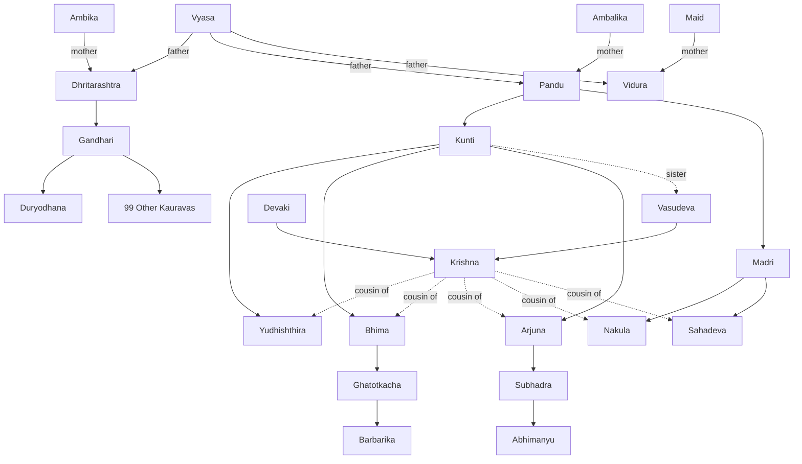

```mermaid
graph TD

%% ===== Parents Generation =====
Vyasa["Vyasa"]

Ambika["Ambika"]
Ambalika["Ambalika"]
Maid["Maid"]

Vyasa -->|father| Dhritarashtra["Dhritarashtra"]
Vyasa -->|father| Pandu["Pandu"]
Vyasa -->|father| Vidura["Vidura"]

Ambika -->|mother| Dhritarashtra
Ambalika -->|mother| Pandu
Maid -->|mother| Vidura

%% ===== Dhritarashtra Family (Kauravas) =====
Dhritarashtra --> Gandhari["Gandhari"]

Gandhari --> Duryodhana["Duryodhana"]
Gandhari --> Kauravas["99 Other Kauravas"]

%% ===== Pandu Family (Pandavas) =====
Pandu --> Kunti["Kunti"]
Pandu --> Madri["Madri"]

Kunti --> Yudhishthira["Yudhishthira"]
Kunti --> Bhima["Bhima"]
Kunti --> Arjuna["Arjuna"]

Madri --> Nakula["Nakula"]
Madri --> Sahadeva["Sahadeva"]

%% ===== Next Generation =====
Bhima --> Ghatotkacha["Ghatotkacha"]
Ghatotkacha --> Barbarika["Barbarika"]

Arjuna --> Subhadra["Subhadra"]
Subhadra --> Abhimanyu["Abhimanyu"]

%% ===== Krishna Line =====
Vasudeva["Vasudeva"]
Devaki["Devaki"]

Vasudeva --> Krishna["Krishna"]
Devaki --> Krishna

%% ===== Relationships =====
Kunti -. sister .-> Vasudeva
Krishna -. cousin of .-> Yudhishthira
Krishna -. cousin of .-> Bhima
Krishna -. cousin of .-> Arjuna
Krishna -. cousin of .-> Nakula
Krishna -. cousin of .-> Sahadeva
```
